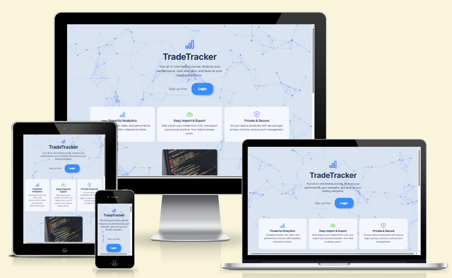
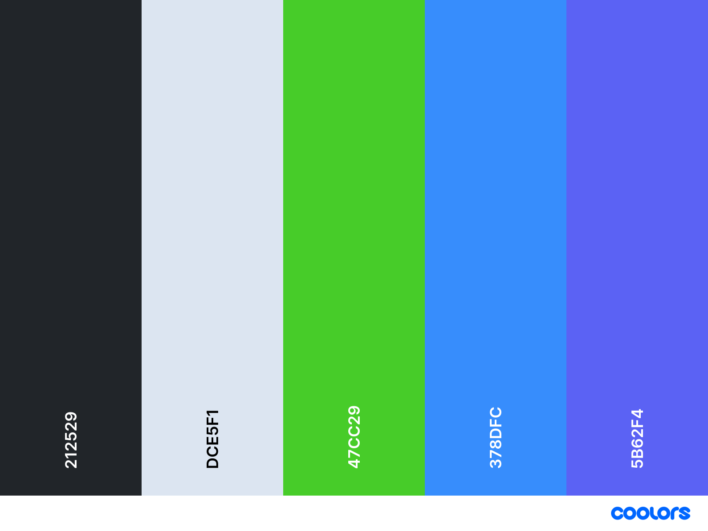
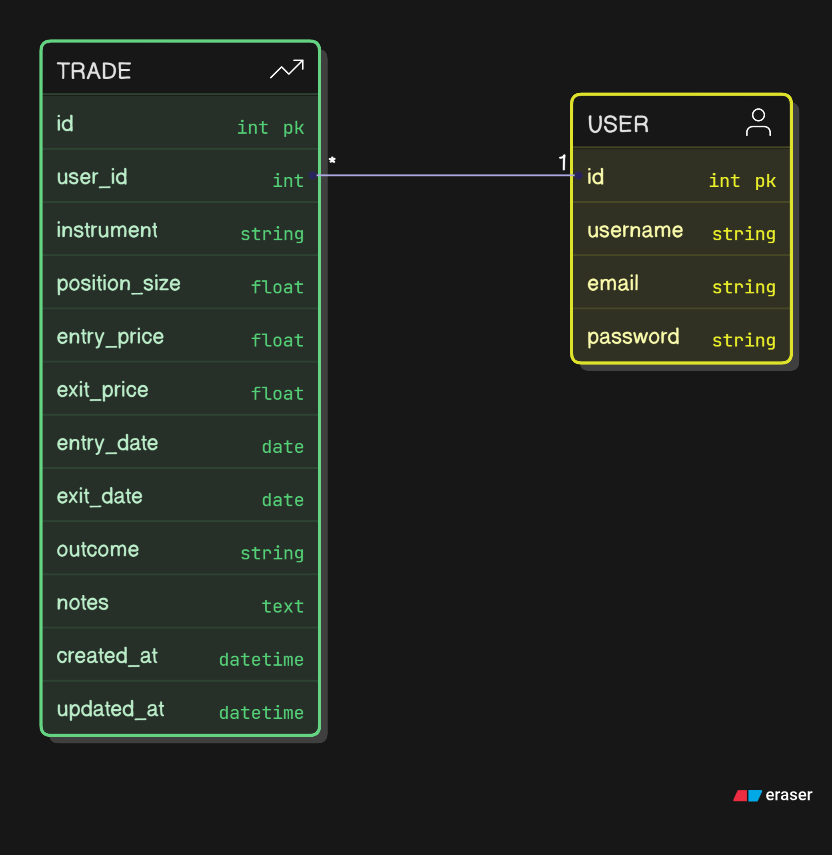

# TradeTracker 📈


**TradeTracker** is a full-stack Django web application that helps users track their trades and view key statistics. Users can log in to add, update, and delete trades, and view a personalized dashboard with insights such as win rate, average return, and holding time — all with custom date filtering.

[Live Demo](https://trade-tracker-0f5ec3eccb7d.herokuapp.com/)

  

## Key features

- User authentication (registration, login, logout)
- Landing page with app description
- Add/Edit/Delete trades with form validation
- Dashboard with:
  - Total trades
  - Win rate %
  - Average return %
  - Average holding time (days)
  - Open vs closed trade count
- Date-based filtering:
  - Preset buttons (Today, Last Week, etc.)
  - Interactive date slider (instant filtering)
- Responsive Bootstrap layout

## contents

1. [Features](#features)
2. [User Experience (UX)](#user-experience-ux)
   - [Design Choices](#design-choices)
   - [Typography](#typography)
   - [Imagery](#imagery)
   - [User Stories](#user-stories)
   - [Wireframes](#wireframes)
3. [Information Architecture](#information-architecture)
   - [Flowchart](#flowchart)
   - [Database Schema Diagram](#database-schema-diagram)
4. [Technologies Used](#technologies-used)
5. [Agile Methodology](#agile-methodology)
   - [Kanban Workflow](#kanban-workflow)
   - [Project Evolution](#project-evolution)
6. [Version Control](#version-control)
7. [Deployment](#deployment)
8. [Testing](#testing)
9. [Known Issues and Future Features](#known-issues-and-future-features)
10. [Credits](#credits)
    - [Resources Used](#resources-used)
    - [Code Used](#code-used)
    - [Acknowledgements](#acknowledgements)

---

## Features

### Existing Features

1. **User Registration & Authentication**
   - Secure signup, login, logout
   - Password reset via email
   - User data is private

2. **Trade Journal Management**
   - Add, edit, and delete trades
   - Import/export trades via CSV
   - Trade fields: instrument, size, price, entry/exit, notes, outcome

3. **Advanced Dashboard & Analytics**
   - Overview cards (Win rate, Avg Return, Win Streak, etc.)
   - Custom date ranges and instant filtering
   - Chart.js data visualizations
   - Filter by instrument or trade outcome

4. **User Feedback & Notifications**
   - Toast messages for create/update/delete
   - Confirmation modals for deletions
   - Error and info notifications

5. **Responsive Design**
   - Fully responsive on mobile, tablet, desktop
   - Custom Bootstrap theme and icons
   - Looks great in dark/light mode

6. **Admin Panel**
   - Django admin for advanced user and trade management

[Go to Contents](#contents)

---


## User Experience (UX)

### Design Choices

#### Color Scheme

The color [palette](https://coolors.co/212529-dce5f1-47cc29-378dfc-5b62f4/) was selected to evoke trust and focus:
- Navy blue for professionalism and clarity
- Orange for energy (calls to action)
- Light sand for calm
- Teal and brown for highlights




#### Typography

- **Inter** is the primary font, for modern, readable screens
- Font weights/boldness used to create hierarchy in dashboards and cards

#### Imagery

- Uses screenshots of real trading charts for demo/benefit sections
- Bootstrap icons throughout (for analytics, security, etc.)
- User avatars on testimonials


#### User Stories

##### Visitors
- As a visitor, I can view the landing page but cannot see or edit any trades.

##### Registered Users
- As a user, I can register an account.
- As a user, I can log in and log out securely.
- As a user, I can add a new trade to my journal.
- As a user, I can edit or delete only my own trades.
- As a user, I can view summary statistics and charts on my dashboard.
- As a user, I can filter or search my trades by instrument, outcome, and date.
- As a user, I receive confirmation messages when I create, update, or delete a trade.
- As a user, I can import and export trades using CSV.
- As a user, I can reset my password if I forget it.

##### Admin Users
- As an admin, I can view, add, edit, or delete any trade from any user.
- As an admin, I can view, add, edit, or delete any user account.
- As an admin, I can access the Django admin dashboard for advanced management.
- As an admin, I can monitor platform activity for quality and security.
- As an admin, I can moderate or remove inappropriate trade notes or user content if needed.

#### Wireframes

Key pages wireframed:
- Landing Page
- Dashboard
- Trade List
- Add trades

Wireframes were created bu using Visily.ai
<details>
<summary>Landing Page</summary>
<br>


</details>

<details>
<summary>Dashboard</summary>
<br>


</details>

<details>
<summary>Trade List</summary>
<br>


</details>

<details>
<summary>Add trades</summary>
<br>


</details>

> *(Insert wireframe images as appropriate)*

#### Flash Messages
TradeTracker uses Django’s messages framework, rendered as non-blocking **Bootstrap toasts** with the following characteristics:

- **Location:** Toasts appear stacked at the top-right corner of every page (`.toast-container` in `base.html`).
- **ARIA live region:** Wrapped with `role="status"`, `aria-live="polite"` and `aria-atomic="true"` so screen-readers announce them immediately.
- **Auto-dismiss:** Success toasts auto-close after 4 seconds via a small initialization script.
- **Undo support:** Delete actions include an **Undo** link in the toast, which restores the most recently deleted trade.
- **Customization:** All styling and behavior is defined in `templates/trades/base.html` and can be adjusted there.

[Go to Contents](#contents)

---
## Information Architecture

### Database Schema Diagram

TradeTracker uses a simple but robust schema:
- Each user can have many trades.
- Each trade belongs to one user.
- All trade data (instrument, size, prices, outcome, etc.) is stored in the Trade table.

#### Entity Relationship Diagram (ERD):



> **Note**: This diagram shows a simplified user table. In production, TradeTracker uses Django’s built-in User model, which includes more fields for security, permissions, and profile management. Admin users are flagged via `is_staff` and `is_superuser` in Django’s auth system.

[Go to Contents](#contents)


### Languages and Frameworks

- [](https://tim.2bn.dev/markdown-builder) used to generate README and TESTING templates.

- [](https://en.wikipedia.org/wiki/HTML5) used for structuring the website.

- [](https://en.wikipedia.org/wiki/CSS) used for styling and layout.

- [](https://www.javascript.com) used for user interaction on the site.

- [](https://www.python.org) used as the back-end programming language.

- [](https://getbootstrap.com) used as the front-end CSS framework for modern responsiveness and pre-built components.

- [](https://www.djangoproject.com) used as the Python framework for the site.

- [](https://django-crispy-forms.readthedocs.io/) used to build customizable, responsive forms.

- [](https://django-crispy-forms.readthedocs.io/en/latest/crispy_tag_form_helper.html) used for styling forms with Bootstrap 5 in Django.


### Databases

- [](https://dbs.ci-dbs.net) used as (production) - For reliable, scalable production data storage.

### Other Tools

- [](https://git-scm.com) used for version control. (`git add`, `git commit`, `git push`, `git status`)

- [](https://github.com) used for secure online code storage and codespaces for cloud-based IDE for development.

- [](https://www.heroku.com) used for simplify deployment, manage scaling, and streamline environment setup for my Django app with minimal configuration.

- [](https://github.com/klis87/django-cloudinary-storage) used for managing and serving media files via Cloudinary.

- [](https://chat.openai.com) used to help debug, troubleshoot, README.md design and explain things.

- [](https://fontawesome.com) used Font Awesome for easily adding scalable icons and styling them in my project.

- [![Favicon](https://img.shields.io/badge/Favicon-grey?logo=data:image/png;base64,iVBORw0KGgoAAAANSUhEUgAAACAAAAAgCAYAAABzenr0AAAAAXNSR0IArs4c6QAABnVJREFUWEfFl39Q1HUax9/P97s/2S2QH4qKoBXsBqQoYb/uvOzHXDXdADdXM87kObs0p0JaN9dMZu0i4DRzU9fNldVpI3r9gU7WZYpYl4WAHclZg6mBQJiihLDAyu6yy+5+v0/z/a6QccCuM830+Wvn83me5/36PM/n+eznS/iFB/3C+pgRoPPt8rSwRlgqQJBkQTx+65rNgz838LQAZ6srnQRyMlgMBUN4f8/+sd4L37+nExNKXu/qGvu5QKYE6NpV9ZDEXAdEMnT6ZBs+PvAfVZMgOLafG9h6vQBn/7V1vhyW7tRqMBQwyp/nPl4RVOOVl5cLLS0t5r2OpzV+T/+Y++L5+0G8q7a1O7Gluw9Vv78bB9+rQ0db51UA9A3dPpi2bx+kWCHO7qzcBEIFAJ3iw8AFIjxhsTmbyJqb+28iFL/zwkZY0+fxqNtFV/ovoqGtB6d6BlB6/xK8+bcdCPgDE3pEVLC923UiFoCO3VtXMPNRME/OthekKVAAXmPmDTXOZ2BJn6fGDHhHMNgT2fGoz4+3Xt3xUy2mtTu+c02anBqnY1eVg8HPqudJpi+Z+DYCKyVMZKCGVq9ebXrsjhz3yqXZmnBwDFpDnBpp6FI3/CPDCIfC2PbKPyGFr804Ve0453LGkoH2nVUlosCcaXNWj9t3VFesYlANA31qWrzNh3o8ru/TdEYz9KYbVDtFXIFQRsORJpxo/mpC79Yl2a//eX/TxlgAet591Rj2XeFFtoqJGnZWv5QiI9zPIF8E4Iu6l8H87LUB/R43hi5+q04xM7451Y6+3suYk5qCnLwcnyzLd2Y/ueV0LBCTbdp3VlmIuB2gVhWAT7+r843EbQTRI6ScVEKrq6fLPObzPsGyJE4j4hYINZIko7/1ZAbLPB+gFIATABiUsMaU5JH4jPTzBOF/Mkt7rSXl9Uqsjuqt/2DIGwHaPONN6DqyZ/PwpXNVshQWZtqp69QZhAM/dsm4rTltPsxzU69xpT0EuBm8Doz2UEBaPiOAv/nwQu/I4LnxszAdRGDYDfe33UqtfmxVUURyTjZEvdr61w4JRB/qEC5bZKuIHMKZhqe51jXQ3ZYUGvPPaBf0eDE6MABpbAyiTgdTaiq0pkhH/XTQFxa7467xuagA3uZDLd7hgYIrfReisca0zoDHanfeGDOA7791+8JS8A99nV/HJBDNiAA5aJaME/8F0Rx8xw+Vs4wtA9+1I+j3RTOPuq4AjITmGG5fuzakGEctgaf54L0EoX6k/xI8g31RBaIZEDCaZXeaYi4B19drfIbR7oD3yoLBnq5o8aOuE+FCls2ZETOAYtj7/vZXTLPn/CXaORC1OsTFJ8FgjlezFfC4/w+IQV9Z7Y786wJoKCtek3HXr3eHOQgppL4joIiJGh0EUYRWb1RFdXFmdW10yIXB810QDNqpMlJvsTvvuz6AdcX3geRPZ91yC/Sz4lVfU0KylDA3YxTAiJIk5WZjUIt/+PKxtkP7D5AgLpjqIiKio1k2x8rrAmgse3QZy+KXhqQkJNy0cNz3jMXuzJ1qi8fKih+UZPmwaDSIiZmZk25Duty7KJy2cmVFOKYuUIwa1xZms4AzglaL2XmLVU2lnQia1Ez75oGpII6WFpYKjG3QiHRjenrQmJyknXgVEVZZbM69MQM0PFV4GySoN1FSTja0ccaIpig+YlnzwuHpjn5DaVEPmNOUh8e85fkVzHgrQi98arG9+EDMAI3ripYz8XHF4YYFaTClzlHjsEybrE86/jodQOP6ooMMflQ11VPivCXLasG4BwyZoV9gLXmuN+pFpJbgqcLfsoSPlN+GxMTWhJsX5an0hOosm7NkWoCyopdY5ufVZAma3JRleXNB/MnVGpZZbM43YwI4Wla0mmR+R3EU9Lo/zl68+G2A9QAdsdgdD04H0FRatEpmrlFhRf7Vim0HPm/fWXmCCPkA1Vrsjt9FBahfV7RQFPB3Zi4iIKhJjL8p+ebMjxisdMBJi92pZmPyqNvwsN4k6baAsUlZ0wjC3fe88UFzx+7Kl1mG8vxznzRbk6MCNJYWHmbGQ6qAIHyQmr80G4DlquA3FrszZyqApvWFD8hAJN0AiyKnpeQX5IFRC0S+EbR6YWFUgM/WF/+GBMxVHIymuGOzrJbXIvWnMJi+zrK/OOVnWueGh/W9sr5QBgkiycMrtn348dldlQVg/AmALBCFdDqN4wegjplDyjqt1AAAAABJRU5ErkJggg==&logoColor=528DD7)](https://favicon.io) used a favicon for adding a recognizable icon in browser tabs and bookmarks.

- [](https://whitenoise.readthedocs.io) used for serving static files directly from my Django app on Heroku, simplifying file management and boosting loading speed.

- [](https://fonts.google.com/) used to import the "Inter" font for consistent typography and styling.

- [](https://validator.w3.org/) - Used to check the validity of HTML code and ensure it adheres to web standards.

- [](https://jigsaw.w3.org/css-validator/) - Used to validate CSS code for errors and improve styling consistency.

- [](https://jshint.com/) - Used to identify and fix errors in JavaScript code.

- [](https://coolors.co/) - Used to generate and manage consistent color palettes for the project.


- [](https://www.eraser.io/diagramgpt) - Used for ERD.

- [](https://ui.dev/amiresponsive) - Used to test and showcase responsiveness across various device sizes.


- [](https://pep8ci.herokuapp.com/) - Used to validate Python code for compliance with PEP8 style guidelines

- [](https://stackoverflow.com/) - Used to research and resolve coding challenges encountered during development.

-  – landing page animation

[Go to Contents](#contents)

## Agile Methodology

This project was developed using the Agile methodology. All epics and user stories implementation progress was tracked through Github projects Kanban Board which can be found [here](https://github.com/users/carlssonanton87/projects/1).

The Kanban board was structured to track tasks across three main stages, allowing for a straightforward development flow:

1. **To Do**: Tasks identified and planned for the project.
2. **In Progress**: Tasks currently being developed.
3. **Done**: Tasks that have been fully tested and merged.

### Epics, User Stories & Tasks

| Epic | User Story | Task(s) |
|------|------------|---------|
| **User Management** | As a user, I want to register and log in securely, so I can access and manage my trades. | - Set up Django authentication<br>- Configure login/logout views<br>- Style login/register templates |
| **Trade Logging** | As a user, I want to add a new trade with key details, so I can keep track of my trading activity. | - Create `Trade` model<br>- Build add trade form<br>- Set up create view & template |
| | As a user, I want to edit or delete trades, so I can correct mistakes or remove irrelevant ones. | - Add edit view + form<br>- Add delete view with confirmation<br>- Protect views with user check |
| **Dashboard & Insights** | As a user, I want to see my total trades and win rate. | - Write logic for win rate and total count<br>- Display stats in dashboard template |
| | As a user, I want to see average return %, holding time, and open/closed trades. | - Add calculations in views<br>- Format numbers and show in template |
| **UX & Filtering** | As a user, I want to filter trades by outcome or instrument. | - Add filter form (optional)<br>- Build filtering logic into list view |
| **Feedback & Confirmation** | As a user, I want confirmation when I add, edit, or delete a trade. | - Add Django messages to views<br>- Display flash messages in base template |

## Version Control

For version control, I used Git to efficiently track and manage code changes throughout my project. Working in Visual Studio Code on a MacOS setup, I utilized Git's basic commands to maintain a clear version history. My workflow included the following steps:

1. **Development in VS Code**: 
   I used Visual Studio Code as my primary development environment, taking advantage of its integrated terminal to run Git commands directly while working on the project.

2. **Commit Workflow**:
   To keep the project organized and maintain a coherent history, I used a simple commit strategy, frequently staging and committing changes after completing a feature or making improvements. This allowed me to capture the progression of my work and made it easier to review project updates over time.

3. **Basic Git Commands**:
   My Git workflow relied on a few essential commands:
   - `git add <file>` or `git add .`: To stage individual files or all modified files for a commit.
   - `git commit -m "descriptive message"`: To create a commit with a clear message, summarizing the changes made.
   - `git push`: To upload the commits to the remote repository.
   - `git status`: To check the status of staged and unstaged changes, helping ensure no modifications were overlooked.

By sticking to these basic commands, I was able to keep my version history manageable and transparent, capturing meaningful updates without unnecessary complexity.

[Go to Contents](#contents)

## Deployment

This Django application was deployed on Heroku, leveraging its GitHub integration for smooth, automatic deployments. Below is a summary of the deployment process:

1. **Heroku App Creation**:  
   I logged into my Heroku dashboard, selected "New" > "Create new app," and provided a unique app name along with the appropriate region.

2. **GitHub Integration**:  
   In the "Deploy" tab of the Heroku dashboard, I chose GitHub as the deployment method, connected my GitHub account, and selected the repository for this Django app.

3. **Automatic Deployment**:  
   I enabled automatic deployment from the `main` branch. This allows Heroku to redeploy the app automatically whenever changes are pushed to the main branch in GitHub.

4. **Environment Configuration**:  
   In the "Settings" tab, I clicked "Reveal Config Vars" and added essential environment variables for security and functionality:

   - `SECRET_KEY`: My Django secret key
   - `DATABASE_URL`: The database connection URL
   - `CLOUDINARY_URL`: Cloudinary URL for managing images, with `secure=true` to ensure HTTPS delivery
  
   > **Note**: The `DEVELOPMENT` variable is used to control `DEBUG` mode in local environments, allowing safe testing and debugging without affecting production settings.

5. **Buildpack Configuration**:  
   In the "Settings" tab, I configured the buildpack by selecting "heroku/python" to support the Django application.

6. **Automatic Collection of Static Files**:  
   Heroku automatically runs `python manage.py collectstatic` during each deployment to gather all static files into a single directory. This ensures that static assets, like CSS and JavaScript files, are ready to be served in production. During the build, 157 static files were successfully copied to the static file directory.

7. **Verify Deployment**:  
   Once set up, I tested the deployment by clicking "Open App" in Heroku to ensure the application loaded and functioned as expected.


   ---

### Forking and Local Setup

If you’d like to fork this repository and set it up locally, follow these steps:

1. **Fork the Repository**:  
   - Go to the GitHub repository and click on "Fork" to create a copy in your account.

2. **Clone Your Fork**:  
   - Click "Code" on your forked repository, copy the URL, then open your terminal and run:
     ```
     git clone [URL you copied]
     ```

3. **Set Up Virtual Environment**:  
   - Navigate to the project directory:
     ```
     cd [project directory name]
     ```
   - Create a virtual environment:
     ```
     python3 -m venv venv
     ```
   - Activate the virtual environment:
     - On Windows: `venv\Scripts\activate`
     - On macOS and Linux: `source venv/bin/activate`

4. **Install Dependencies**:  
   - With the virtual environment activated, install the required packages:
     ```
     pip install -r requirements.txt
     ```

5. **Set Up Environment Variables**:  
   - Create an `env.py` file in the root directory and add the following environment variables based on `settings.py` requirements:
     ```python
     SECRET_KEY = 'your_secret_key'
     DATABASE_URL = 'your_database_url'
     CLOUDINARY_URL = 'your_cloudinary_url?secure=true'
     DEVELOPMENT = 'True'
     ```
   - Setting `DEVELOPMENT = 'True'` enables `DEBUG=True` in local development, allowing you to test and debug safely.
   - Adding `secure=true` to the `CLOUDINARY_URL` ensures media files are delivered over HTTPS, providing secure access to images and assets.

6. **Apply Migrations**:  
   - Run migrations to set up the database schema:
     ```
     python3 manage.py makemigrations
     python3 manage.py migrate
     ```

7. **Collect Static Files (Optional for Local Testing)**:  
   - If you want to test static files locally in a production-like setup, you can run:
     ```bash
     python3 manage.py collectstatic
     ```
   - This is typically required in production but can be helpful to verify static files locally.

8. **Run the Development Server**:  
   - Start the server locally:
     ```
     python3 manage.py runserver 8001
     ```
   - Note: This project initially used port `8000` but now uses port `8001` to avoid conflicts with other services.
   - Open a browser and go to `http://127.0.0.1:8001/` to view the application locally.

---

This enhanced setup provides a clear process for cloning, setting up environment variables, and preparing the local environment based on your project’s specific configuration requirements.

---

[Go to Contents](#contents)

## Testing

Comprehensive testing has been performed to validate the functionality, usability, and reliability of this Django application. 

For further details on specific test cases, results, and testing methodologies, please refer to the [TESTING.md](TESTING.md) file.

[Go to Contents](#contents)


## Known Issues and Future Features

### Future Features
- Multi-currency and multi-account support
- More visualizations (pie charts, scatter plots)
- Trade tagging and advanced filtering
- Optional public trade sharing
- More integrations (broker APIs, news, etc)
- Advanced analytics (drawdown, max risk, equity curve)
- Email/SMS notifications for goals and alerts

### Known Issues
- Tagging and advanced analytics are not yet implemented.
- Imports may fail on malformed CSV files—see help docs for formatting tips.

### Bugs & Fixes

| Bug                                                                                     | Fix                                                                                     |
|-----------------------------------------------------------------------------------------|-----------------------------------------------------------------------------------------|
| **Missing `crispy_forms`** – startup error: “No module named ‘crispy_forms’”            | Removed `crispy_forms` from `INSTALLED_APPS` (or install `django-crispy-forms` package) |
| **URL reverse lookup failures** – templates error “Reverse for ‘trade_list’ not found” | Harmonized view names and URL patterns (`trade_list`, etc.) and updated all template links |
| **Indentation error** – “SyntaxError: ‘return’ outside function”                        | Fixed indentation so each `return` resides inside its corresponding view function       |
| **Missing form template** – “TemplateDoesNotExist: bootstrap5/uni_form.html”            | Installed/configured `django-bootstrap5` or reverted to default Django form templates   |
| **Decimal serialization** – “TypeError: Decimal is not JSON serializable”               | Cast `Decimal` values to `float` (or `str`) before passing into JSON/script tags        |
| **Unbound `context` variable** – “UnboundLocalError: cannot access local variable ‘context’” | Defined the `context = {...}` dictionary before any `context.update()` or `return` calls  |
|


## Error Handling

TradeTracker includes custom error pages for a polished user experience:

- **404 – Page Not Found**: Displayed when a user visits an invalid URL.
- **500 – Server Error**: Displayed when something goes wrong on the server side.

To view these, set `DEBUG = False` in `settings.py` and visit a broken link or trigger an exception.


## Credits

### Resources Used

- [Code Institute LMS](https://codeinstitute.net/) — For foundational Django/project structure and ongoing support.
- [Bootstrap 5](https://getbootstrap.com/) & [Bootswatch Morph Theme](https://bootswatch.com/morph/) — For responsive layouts and modern design.
- [Django Documentation](https://docs.djangoproject.com/en/stable/) — For best practices and advanced framework features.
- [Chart.js](https://www.chartjs.org/) — For interactive dashboard charts and data visualizations.
- [noUiSlider](https://refreshless.com/nouislider/) — For interactive date slider in the dashboard
- [tsParticles](https://particles.js.org/) — For animated hero backgrounds on the landing page.
- [Alpha Vantage API](https://www.alphavantage.co/) — For optional market/instrument data integration in advanced trade logging features.
- [Unsplash](https://unsplash.com/) — For sample dashboard/landing page images.
- [Coolors](https://coolors.co/) — For generating and managing the project color palette.
- [Stack Overflow](https://stackoverflow.com/) — For troubleshooting Django, JavaScript, and deployment issues.


### Code Used

- Based on Django starter templates from [Code Institute](https://codeinstitute.net/).
- [Chart.js](https://www.chartjs.org/) and [tsParticles](https://particles.js.org/) integration guided by their official docs and open-source portfolio examples.
- CSS and landing page layout inspired by [stonkjournal.com](https://stonkjournal.com/) and [Bootstrap Dashboard Templates](https://bootswatch.com/).
- Minor JavaScript and Django snippets adapted from [Stack Overflow](https://stackoverflow.com/) and [GitHub Gists](https://gist.github.com/).

### Acknowledgements

- **Mentors & Reviewers** — For invaluable feedback and encouragement.
- **Friends & Beta Testers** — For UI feedback and real-world trading workflow testing.
- [Code Institute Slack Community](https://codeinstitute.net/slack-community/) — For Q&A, support, and shared resources.
- [ChatGPT](https://chat.openai.com/) — For troubleshooting, code review, and documentation help.


