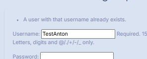
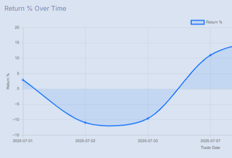
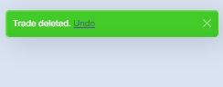
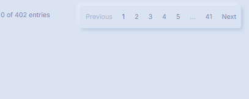
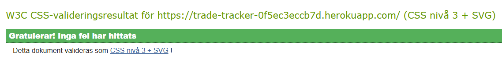

# 🧪 Testing - TradeTracker

This document outlines the testing strategy for the TradeTracker Django project.

> [!NOTE]
> Return back to the [README.md](README.md) file

## Content Table

1. [Manual Testing](#manual-testing)
    - [User Management](#user-management)
    - [Dashboard & Insights](#dashboard--insights)
    - [Trade Logging](#trade-logging)
    - [Feedback & Confirmation](#feedback--confirmation)
    - [UX & Filtering](#ux--filtering)
2. [Automated Testing](#automated-testing)
    - [Python Unit Tests](#python-unit-tests)
    - [What is Tested](#what-is-tested)
    - [Optional: Run with Coverage](#optional-run-with-coverage)

4. [Browser Compatibility](#browser-compatibility)
7. [Responsiveness](#responsiveness)
9. [Device Testing](#device-testing)
5. [HTML Testing](#html-testing)
6. [CSS Testing](#css-testing)
7. [JavaScript Testing](#javascript-testing)
7. [Lighthouse Testing](#lighthouse-testing)
7. [PEP8 Testing](#pep8-testing)
6. [TODO (Future)](#todo-future)

## 👤 Manual Testing

### Test Scenarios for User Stories

### User Management

#### US01: As a user, I want to register and log in securely, so I can access and manage my trades.

[Kanban Board (USER STORY: User Management)](https://github.com/carlssonanton87/milestone-project-3/issues/1)

| **Test Scenario ID** | **Test Scenario**                 | **Steps to Test**                                                                                                                         | **Expected Result**                                         | **Pass/Fail** | **Screenshots**                                             |
| -------------------- | --------------------------------- | ----------------------------------------------------------------------------------------------------------------------------------------- | ----------------------------------------------------------- | ------------- | ----------------------------------------------------------- |
| UM-TS01              | Registration form loads correctly | Open `/signup/` (or Registration link). Confirm username, password, and password confirmation fields are shown, styled with crispy forms. | Form loads, styled consistently and responsively.           | Pass          |  |
| UM-TS02              | Successful registration flow      | Fill form with valid username/password and submit.                                                                                        | User is registered, logged in, and redirected to dashboard. | Pass          |  |
| UM-TS03              | Duplicate username validation     | Attempt to register with an existing username.                                                                                            | Error shown for duplicate username.                         | Pass          |  |
| UM-TS04              | Weak password validation          | Enter a password like `1234` or `password`.                                                                                               | Error shown for password complexity.                        | Pass          |  |
| UM-TS05              | Password mismatch validation      | Enter different passwords in the two fields.                                                                                              | Error shown for password mismatch.                          | Pass          |  |
| UM-TS06              | Login form loads and submits      | Visit `/login/`, fill valid credentials, and submit.                                                                                      | User is logged in, redirected to dashboard.                 | Pass          |  |
| UM-TS07              | Login with incorrect credentials  | Attempt login with wrong username or password.                                                                                            | Error shown, user not logged in.                            | Pass          |  |
| UM-TS08              | Flash messages display            | Logout                                                                                                                                    | Success/info messages appear for each event.                | Pass          |  |
| UM-TS09              | Trade pages require login         | Log out and attempt to visit `/dashboard/` or `/trades/`.                                                                                 | Redirected to django admin login page                       | Pass          |  |
| UM-TS10              | Password reset request loads      | Click "Forgot password?", submit email.                                                                                                   | Email sent if registered, success message shown.            | Pass          |  |
| UM-TS11              | Password reset process completes  | Open password reset link from email, set new password.                                                                                    | Password updated, user can log in with new password.        | Pass          |  |
| UM-TS12              | Accessibility of auth forms       | Navigate all auth forms with keyboard and screen reader.                                                                                  | All labels, focus, ARIA, and error messages present.        | Pass          |  |

---

## Dashboard & Insights 

### US01 & US02: As a user, I want to see my total trades, win rate, average return %, holding time, and trade outcomes.

[Kanban Board (USER STORY: Dashboard & Insights )](https://github.com/carlssonanton87/milestone-project-3/issues/3)

| **Test Scenario ID** | **Test Scenario**                     | **Steps to Test**                                                  | **Expected Result**                                                             | **Pass/Fail** | **Screenshots**                                             |
| -------------------- | ------------------------------------- | ------------------------------------------------------------------ | ------------------------------------------------------------------------------- | ------------- | ----------------------------------------------------------- |
| DI-TS01              | Dashboard loads and shows metrics     | Log in and go to `/dashboard/`                                     | Total trades, win rate, average return %, avg hold, outcomes are shown in cards | Pass          |  |
| DI-TS02              | Metric cards have color and icons     | Look at dashboard metric cards                                     | Cards use color (green, red, blue, yellow, etc) and icons for each stat         | Pass          |  |
| DI-TS03              | View win rate calculation             | Close some trades as wins and losses, check dashboard              | Win rate % reflects actual trade outcomes                                       | Pass          |  |
| DI-TS04              | Average return calculation            | Add/edit trades with positive/negative returns                     | Average return % matches trade data                                             | Pass          |  |
| DI-TS05              | Average holding time calculation      | Add/edit trades with various holding times                         | Avg hold time is correctly calculated and displayed                             | Pass          |  |
| DI-TS06              | Card for open vs closed trades        | View dashboard with mix of open/closed trades                      | Card displays "X open / Y closed" accurately                                    | Pass          |  |
| DI-TS07              | Chart visualizes return % over time   | View "Return % Over Time" chart on dashboard                       | Chart.js renders a line or bar chart with correct data                          | Pass          |  |
| DI-TS08              | Date filter presets work              | Click "Today", "This week", "Last month" buttons                   | Metrics and chart update according to selected date range                       | Pass          |  |
| DI-TS09              | Date slider (range) filters dashboard | Drag slider to custom date range, release                          | Metrics and chart update, spinner shows while loading                           | Pass          |  |
| DI-TS10              | Loading spinner appears on filter     | Select any date filter or move slider                              | Spinner appears, then hides when data loads                                     | Pass          |  |
| DI-TS11              | Dashboard is responsive               | Resize window/mobile device                                        | Cards, chart, and filters look good on all devices                              | Pass          |  |
| DI-TS12              | Accessibility of dashboard cards      | Navigate dashboard cards and filters with keyboard & screen reader | All metrics, icons, and charts are accessible, labeled                          | Pass          |  |

## Trade Logging 

### US01 & US02: As a user, I want to add, edit, and delete trades to keep an accurate journal.

[Kanban Board (USER STORY: Trade Logging )](https://github.com/carlssonanton87/milestone-project-3/issues/2)

| **Test Scenario ID** | **Test Scenario**                       | **Steps to Test**                                           | **Expected Result**                                                                          | **Pass/Fail** | **Screenshots**                                             |
| -------------------- | --------------------------------------- | ----------------------------------------------------------- | -------------------------------------------------------------------------------------------- | ------------- | ----------------------------------------------------------- |
| TL-TS01              | Add Trade form loads                    | Go to “Add Trade” page as a logged-in user                  | All fields (instrument, size, prices, dates, outcome, notes) are displayed, labels are clear | Pass          |  |
| TL-TS02              | Submit new trade with valid data        | Fill out and submit form                                    | New trade appears in trade list; dashboard updates                                           | Pass          |  |
| TL-TS03              | Validation: required fields             | Try submitting form with missing fields                     | Error messages for missing required fields                                                   | Pass          |  |
| TL-TS04              | Validation: non-negative prices & logic | Enter negative numbers or end date before start date        | Validation prevents submission; errors shown                                                 | Pass          |  |
| TL-TS05              | Edit existing trade                     | From list, click edit on a trade, update values, submit     | Changes are saved and visible in list and dashboard                                          | Pass          |  |
| TL-TS07              | Delete trade with confirmation          | Click delete, confirm in modal or form, trade is removed    | Trade disappears from list and dashboard updates                                             | Pass          |  |
| TL-TS08              | Delete another user's trade (security)  | Log in as user B, try deleting user A's trade (URL hacking) | 404 or error; trade is not deleted                                                           | Pass          |  |
| TL-TS09              | Success/error messages shown            | Add, edit, or delete a trade                                | Toast or alert confirms success or error                                                     | Pass          |  |
| TL-TS10              | Trade list: pagination works            | Add 30+ trades, view “My Trades”                            | Trade list paginates (next/prev), navigation works                                           | Pass          |  |
| TL-TS11              | Trade list: search/filter works         | Use filter/search for instrument, outcome, date             | Table updates to show filtered trades only                                                   | Pass          |  |
| TL-TS12              | Trade list: sort works                  | Click table headers or sort options                         | Trades re-order by selected field (date, return, etc.)                                       | Pass          |  |
| TL-TS13              | CSV Export                              | Click “Export CSV”, open downloaded file                    | File has correct headers and trade rows                                                      | Pass          |  |
| TL-TS14              | CSV Import                              | Use “Import CSV”, select valid file                         | Trades are added; success message shown                                                      | Pass          |  |
| TL-TS15              | CSV Import: bad file                    | Try to import file with missing/invalid columns             | 500 - server error shown                                                                     | Pass          |  |
| TL-TS16              | Accessibility on forms                  | Navigate add/edit trade form with keyboard & screen reader  | All fields & errors are labeled, ARIA used                                                   | Pass          |  |
| TL-TS17              | Undo delete action (if implemented)     | Delete a trade, click "Undo" in toast                       | Trade is restored and re-appears in list                                                     | Pass          |  |

## Feedback & Confirmation 

### US01: As a user, I want confirmation when I perform actions so I know they worked.

[Kanban Board (USER STORY: Feedback & Confirmation )](https://github.com/carlssonanton87/milestone-project-3/issues/4)

| **Test Scenario ID** | **Test Scenario**                | **Steps to Test**                                       | **Expected Result**                                      | **Pass/Fail** | **Screenshots**                                             |
| -------------------- | -------------------------------- | ------------------------------------------------------- | -------------------------------------------------------- | ------------- | ----------------------------------------------------------- |
| FC-TS01              | Success message on trade add     | Add a new trade via form                                | Toast message appears: "Trade successfully added."       | Pass          |  |
| FC-TS02              | Success message on trade edit    | Edit an existing trade                                  | Toast: "Trade updated successfully."                     | Pass          |  |
| FC-TS03              | Success message on trade delete  | Delete a trade                                          | Toast: "Trade deleted" (with Undo link if implemented)   | Pass          |  |
| FC-TS04              | Info message on logout           | Log out from the app                                    | Toast: "You have been logged out."                       | Pass          |  |
| FC-TS05              | Error message on bad form        | Submit form with errors (e.g., missing required fields) | Toast: Error message describing what went wrong          | Pass          |  |
| FC-TS06              | ARIA live region for alerts      | Use screen reader or inspect element                    | Toast container has `aria-live="polite"` or `assertive`  | Pass          |  |
| FC-TS07              | Auto-dismiss of alerts           | Add/edit/delete trade and wait 4 seconds                | Toast automatically disappears after 3–5 seconds         | Pass          |  |
| FC-TS08              | “Undo” delete action             | Delete a trade, then click "Undo" in the toast          | Trade is restored, confirmation message shown            | Pass          |  |
| FC-TS09              | Global include for messages      | Add, edit, or delete from any page                      | Toasts have consistent appearance/layout everywhere      | Pass          |  |

## UX & Filtering

### US01: As a user, I want to filter trades by instrument or outcome.

[Kanban Board (USER STORY: UX & Filtering )](https://github.com/carlssonanton87/milestone-project-3/issues/5)

| **Test Scenario ID** | **Test Scenario**        | **Steps to Test**                                          | **Expected Result**                                   | **Pass/Fail** | **Screenshots**                                               |
| -------------------- | ------------------------ | ---------------------------------------------------------- | ----------------------------------------------------- | ------------- | ------------------------------------------------------------- |
| UXF-TS01             | Filter by instrument     | Open Trade List, select an instrument from the filter form | Only trades for the selected instrument are shown     | Pass          |  |
| UXF-TS02             | Filter by outcome        | Click “Win”, “Open”, or “Loss” filter button               | Only trades with that outcome are displayed           | Pass          |  |
| UXF-TS03             | Clear filters            | Click “Reset” or equivalent clear filter action            | All trades are shown again                            | Pass          |  |
| UXF-TS04             | Sort by date (asc/desc)  | Use table sort for date column                             | Trades re-ordered accordingly                         | Pass          |  |
| UXF-TS05             | Sort by result           | Use table sort for result column                           | Trades sorted by outcome (“Win”, “Loss”, “Open”, etc) | Pass          |  |
| UXF-TS06             | Pagination on trade list | Trade list has > X trades, check page controls             | Pagination controls appear, navigation works          | Pass          |  |
| UXF-TS07             | Filter + sort combo      | Apply filter then sort (or vice versa)                     | Both filter and sort stay active                      | Pass          |  |
| UXF-TS09             | Mobile view usability    | Apply filters and sorting on mobile                        | All filter/sort features are usable and responsive    | Pass          |  |
| UXF-TS10             | No trades found          | Use filter/sort to get zero results                        | “No trades found” message is shown clearly            | Pass          |  |

## Automated Testing

### Python Unit Tests
Comprehensive unit tests were developed for the Django application to verify the functionality of individual components. These tests focus on:

We use Django’s built-in `TestCase` class to validate core functionality.

### ✅ To run tests:

python manage.py test

## ✅ What is Tested

### `trades/tests.py`

| Test Name                     | Purpose |
|------------------------------|---------|
| `test_return_percent`        | Ensures return percentage is correctly calculated |
| `test_holding_days`          | Ensures holding duration (in days) is correct |
| `test_trade_str_representation` | Ensures `__str__` returns expected format |
| `test_trade_outcome_choices` | Verifies valid outcome values (`win`, `loss`, `open`) |
| `test_open_trade_return_none` | Ensures open trades return `None` for return and holding time |

## 🧪 Optional: Run with coverage
pip install coverage
coverage run manage.py test
coverage report

---

## 🖥️ Browser Compatibility

Tested manually on:

- Chrome (latest)
- Firefox (latest)
- Safari (Mac)
- Edge

All layouts tested on mobile and desktop screens (responsive design).

---
### Responsiveness

The entire project was built using **Bootstrap 5.3.3**, which provided a powerful grid system and responsive utilities. Leveraging Bootstrap allowed for a quick start and saved significant development time, ensuring the website is fully responsive across different devices.

#### Responsive Design Testing

- Tested on various devices and screen sizes to ensure optimal user experience.
- Used **Chrome DevTools** to emulate different devices and screen resolutions.
- Performed physical testing on four different smartphones to validate the design and functionality on real mobile devices.
- Verified layout and functionality across mobile, tablet, and desktop views.

Key highlights:
- **Efficient Development**: Bootstrap's pre-built components and rich features simplified the implementation of a mobile-first design.
- **Responsive Grid System**: The grid system automatically adjusted layouts for various screen sizes without extensive customizations.
- **Rich Features**: Built-in classes for margins, paddings, and utilities enhanced styling flexibility while maintaining a consistent design.
---

[Go to Contents](#contents)

### Device Testing

The project was tested on various devices to ensure seamless responsiveness and user experience:

| **Devices** | **Landing page** | **Dashboard** | **My trades** | **Notes** |
|-------------|-----------|---------------|-----------------|-----------|
|  |  |  |  | Fully responsive |
|  |  |  |  | Fully responsive |
|  |  |  |  | Fully responsive |
--

## Code Validation

### HTML Testing

I have validated all HTML files using the recommended [HTML W3C Validator](https://validator.w3.org) to ensure they meet current web standards and best practices.

 

### CSS Testing

I primarily used Bootstrap 5.3.3 for styling across the project templates, complemented by custom CSS for specific components and layouts. Additionally, To ensure compliance with current standards and best practices, I validated all custom CSS files using the recommended [CSS jigsaw Validator](https://jigsaw.w3.org/css-validator/)

 

### JavaScript Testing

In this project, I utilized  **JavaScript** for various functionalities:

- **JavaScript**: Primarily used for Bootstrap components and DOM manipulation.

To ensure code quality and adherence to best practices, I validated my custom JavaScript code using the recommended [JSHint Validator](https://jshint.com).

| **Script Type** | **Validation Screenshot**  | **Comments** |
|-----------------|----------------------------|--------------|
| `javaScript Code` |  | |

---

 ## Lighthouse Testing

Lighthouse was utilized to evaluate the **performance**, **accessibility**, **best practices**, and **SEO** of the Green Local Veggies application.

#### Testing Overview

- Tests were conducted for both **desktop** , **tablet** and **mobile** views to ensure a comprehensive analysis.
- The **performance score** was slightly lower on mobile views due to the number of images used in the project. 

## Python (PEP8) Validation

### PEP8 Testing

At the end of the project, all Python files were thoroughly validated to ensure adherence to PEP8 standards. The following tools were used:

- **Black**: To ensure consistent and readable code style across the project, I used [Black](https://pypi.org/project/black//), the uncompromising Python code formatter. Black automatically reformats all Python files according to a strict and widely-accepted standard, eliminating style debates and making the codebase easier to maintain and review. The entire project was formatted using Black before final submission.

This final validation step ensured that the code meets industry-standard best practices for readability and maintainability.

- **PEP8 CI Python Linter**: Custom Python files were validated using the [Code Institute PEP8 Validator](https://pep8ci.herokuapp.com/) to ensure compliance with PEP8 guidelines.

This final validation step ensured that the code meets industry-standard best practices for readability and maintainability.

**Results:**  
All Python files passed the validation checks, confirming compliance with PEP8 standards.

| **Directory Name** | **File Name** | **Validation Screenshot**  | **Comments** |
|--------------------|---------------|----------------------------|--------------|
| `Project Level ` |`manage.py` |  | Passed with no issues |
| `Project Folder ` |`settings.py` |  | Formatting issues resolved |
| `Project Folder ` |`urls.py` |  | Code adjusted for line-length compliance |
| `Trades App ` |`views.py` |  | Passed with no issues|
| `Trades App ` |`forms.py` |  | Code adjusted for line-length compliance|
| `Trades App ` |`urls.py` |  | Passed PEP8 validation |
| `Trades App ` |`admin.py` |  | Passed with no issues |
| `Trades App ` |`models.py` |  | Passed with no issues|

---

[Go to Contents](#contents)

## 🧹 TODO (Future)
- Add Automated test part
- Add integration tests
- Add form validation tests
- Add Performance Testing
- Setup GitHub Actions for CI test runs
